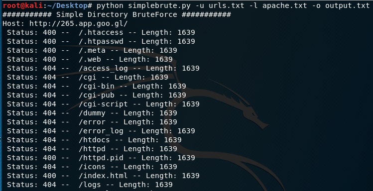

# simple-directory-bruteforce

A simple directory bruteforce script which takes a wordlist and list of urls as input. The output file from this script can then be imported into burp's sitemap with this extension: https://github.com/SmeegeSec/Burp-Importer

The flag options are as follows:  
-u , --url = Path to url input file (REQUIRED)  
-l , --list = Path to bruteforce list file (REQUIRED)  
-o , --output = Path for output file (OPTIONAL)  

**Example usage:**  
`python simplebrute.py --url urls.txt --list apache.txt --output output.txt`  

**Example Output:**  
    
